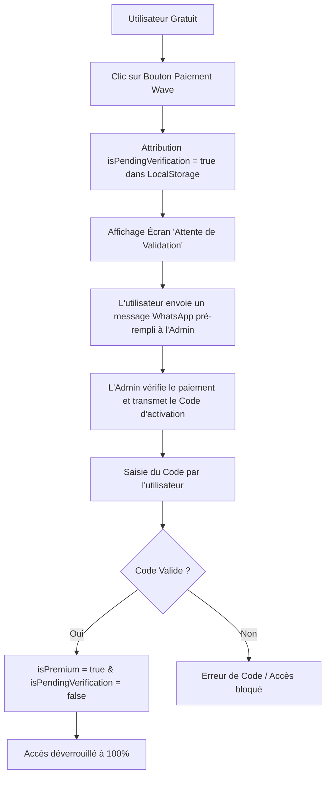

# 🛠️ DOCUMENTATION TECHNIQUE & ARCHITECTURE CODE : SCALIFY

Ce document présente l'architecture logicielle, les flux de données critiques et les algorithmes mis en place au sein de la plateforme **Scalify**.

---

## 📂 1. Structure du Projet

```text
SCALIFY/
├── index.html                   # Interface utilisateur (UI/UX) complète (SaaS et Dashboard)
├── style.css                    # Système de design global, animations, thèmes et chartes graphiques
├── script.js                   # Logique métier, routage d'état, simulateurs, IA et sécurité
├── vercel.json                 # Fichier de déploiement et configuration d'hébergement Vercel
├── assets/                     # Ressources graphiques (logos, icônes)
└── chatbot_knowledge/          # Base de connaissances du copilote IA
    ├── knowledge.json          # Données de référence e-commerce structurées au format JSON
    └── knowledge.js            # Module JS pour l'import local (sans erreur CORS)
```

---

## 🔒 2. Flux de Sécurité & Système de Clé d'Activation

Pour empêcher tout accès prématuré ou non autorisé aux fonctionnalités premium de Scalify (Simulateur, Produits Gagnants, Générateur IA, Académie), la plateforme utilise un système d'état de session persistant couplé à une validation déterministe.



### 🗝️ Algorithme de Génération du Code
Le code d'activation est généré dynamiquement à partir du numéro de téléphone fourni par l'utilisateur lors de son inscription :
$$\text{Code} = (\text{4 derniers chiffres du numéro de téléphone}) + 78$$

*Exemple* : Si le numéro de téléphone est le `77 123 45 67` :
* 4 derniers chiffres = `4567`
* Code d'activation = `456778`

### 🔑 Codes d'Activation "Maître" (Bypass)
Pour faciliter les tests administratifs et le support, des clés d'accès prioritaires sont définies dans `script.js` :
* `SCALIFY-PRO-VIP`
* `784799882` *(Numéro admin)*
* `WAVE221`
* `123456`

---

## 🤖 3. Architecture du Chatbot IA (Copilote E-commerce)

Le chatbot n'utilise pas d'appels API distants coûteux ou lents. Il repose sur une recherche sémantique par mots-clés optimisée en local.

### 📝 Le Fichier de Connaissances (`chatbot_knowledge/knowledge.js`)
Les données sont structurées en **catégories**, possédant chacune des **mots-clés principaux** et une liste de couples **Questions/Réponses** possédant leurs propres sous-mots-clés de ciblage.

### 🔍 Algorithme de Correspondance (Matching Engine)
La fonction `getBotReply(q)` dans `script.js` réalise les étapes suivantes :
1. **Nettoyage** : Passage de la requête de l'utilisateur en minuscules.
2. **Filtrage des priorités** : Vérification des questions génériques sur la plateforme (prix d'abonnement, clés perdues, groupe Telegram VIP).
3. **Scan Thématique** :
   * Parcourt les catégories.
   * Si un mot-clé de catégorie correspond à la phrase, parcourt tous les Q&A de cette catégorie.
   * Compte le nombre de sous-mots-clés correspondants.
4. **Sélection de la meilleure réponse** : Retourne la réponse ayant obtenu le meilleur score de correspondance.
5. **Fallback Intelligent** : Si aucun mot-clé ne correspond, propose un guidage interactif structuré avec des exemples de questions.

---

## 📊 4. Module des Produits Gagnants (Winning Products)

La base de données des produits est déclarée dans la variable constante `TRENDING_PRODUCTS` sous la forme d'un tableau d'objets :

### 📋 Modèle de Données Produit (Schema)
```javascript
{
    id: "prod-ali-X",                                  // ID unique de l'article
    name: "Nom du produit gagnant",                     // Nom commercial lisible
    image: "https://url-de-image-unsplash.jpg",        // Image représentative
    buyPrice: 900,                                     // Prix fournisseur unitaire (en FCFA)
    transportCost: 600,                                // Frais logistiques estimés au kg (en FCFA)
    localFees: 1500,                                   // Coûts de marketing et frais locaux (en FCFA)
    recommendedSalePrice: 9000,                        // Prix de vente Sénégal (×10 ou ×12)
    competitors: "Faible",                             // Niveau de concurrence (Faible / Moyen / Élevé)
    status: "viral",                                   // Statut tendance (viral / stable / risky)
    score: 9.7,                                        // Score d'intérêt global sur 10
    category: "Beauté & Soins",                        // Thématique / Niche du produit
    sourcingLink: "https://www.alibaba.com/...",        // Lien de sourcing direct d'usine Alibaba
    description: "Description marketing courte...",    // Pitch produit
    hooks: [ "Accroche 1", "Accroche 2" ],             // Hooks publicitaires TikTok/FB
    scripts: [ "Script UGC complet..." ],              // Scripts de tournage vidéo UGC
    hashtags: [ "#Hashtag1", "#Hashtag2" ]             // Mots-clés de référencement réseaux
}
```

### 💸 Règle Commerciale de Multiplicateur & Prix Plancher
Pour chaque produit, le prix de vente conseillé au Sénégal (`recommendedSalePrice`) est évalué dynamiquement :
* **Formule** : `Prix de Vente = Prix Achat (Alibaba) × 10`
* **Exception ×12** : Si le résultat de `Prix Achat × 10` est **inférieur à 8 000 FCFA**, on bascule sur `Prix Achat × 12`.
* **Plancher de sécurité** : Si le résultat de la multiplication par 12 reste inférieur au seuil de rentabilité de **8 000 FCFA**, le prix de vente final est automatiquement bloqué à **8 000 FCFA**.

---

## 🐳 5. Déploiement et Hébergement
La plateforme est 100% statique (JAMstack), ce qui garantit des performances maximales et une vitesse de chargement instantanée (critique pour l'Internet mobile en Afrique de l'Ouest).
Elle est configurée pour être déployée en un clic sur **Vercel** ou **GitHub Pages** via son fichier `vercel.json` qui redirige proprement les routes.
